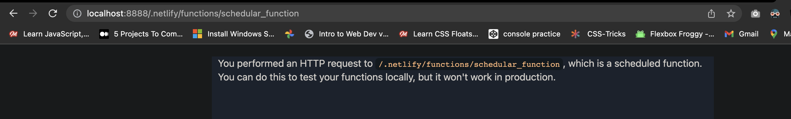
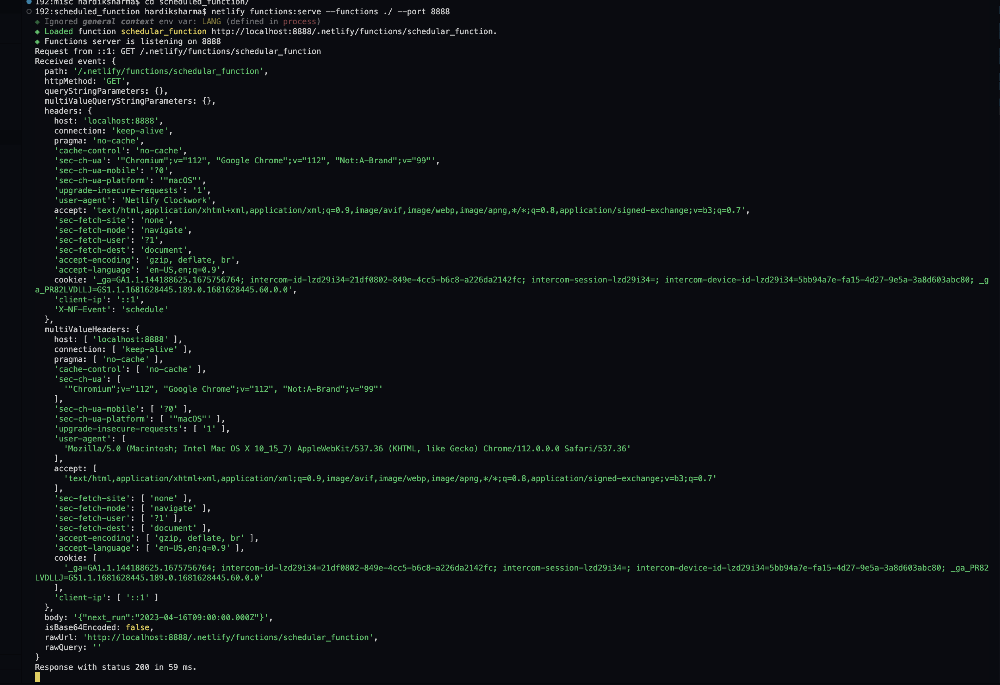

# Instructions

Scheduled functions only run on published deploys and, similar to event-triggered functions, you can’t invoke them directly with a URL. This means that you can’t test with deploy previews, for example.

Therefore, the best way to test a scheduled function is to use Netlify Dev to serve your scheduled function [locally](https://cli.netlify.com/functions-dev/) and then use the ``` netlify functions:invoke ``` command to invoke it. Note that Netlify Dev will not execute the scheduled function on any kind of schedule — the invoke command only allows you to debug the function code invocation.

---

## Usage
Install the latest npm install -g netlify-cli.
Run netlify functions:serve to start the functions server.
Your function will be available at http://localhost:9999/.netlify/functions/{function-name}

By default the server serves functions from the configured functions directory, or netlify/functions if a functions directory is not configured. The default port for the functions server is 9999. To override these settings you can use the --functions and --port flags:

```bash 
netlify functions:serve --functions <path-to-dir> --port <port>
```

---

## Screenshots
#### 1. Event triggered from browser


#### 2. Event Listner


---

## Debugging functions
Netlify CLI uses [Lambda-local](https://github.com/ashiina/lambda-local) to simulate serverless functions. Since the CLI invokes functions in the same process as the functions server, you can debug functions by inspecting the functions server process. To do so set the --inspect Node.js option when starting the functions server:

- On Windows run ``` cmd /V /C "set NODE_OPTIONS=--inspect && netlify functions:serve"```
- On Mac/Linux run ``` NODE_OPTIONS=--inspect netlify functions:serve```
Then attach any Node.js debugger to the CLI process to debug your functions. 

For usage with Visual Studio Code see [here](https://cli.netlify.com/vscode).
